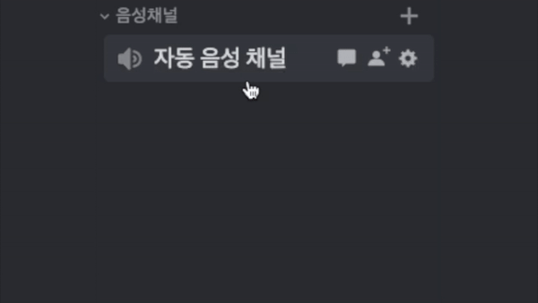
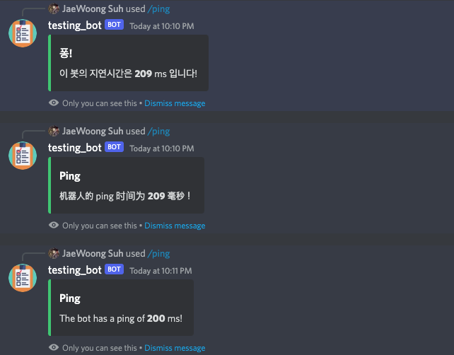

# auto-voice-channel
### A Discord bot that creates voice channels for users with lightning-fast performance.

  

This Discord bot will allow users to create auto voice channels without giving them edit channel permission. The bot will automatically generate a voice channel when the user joins the auto voice channel (previously set by the administrator). One of the most significant strengths is that this project uses Redis to store data, meaning swifter than using a traditional database and fully scalable in the future. Also, all of the messages are easily editable in [language.ini](https://github.com/HongWonYul/auto-voice-channel/blob/main/language.ini])

Also, this bot has a built-in dashboard that allows usr to easily manage the bot. (Not a web dashboard, but a dashboard in Discord using embeds and dropdowns.)

### Offical Bot
Supports Korean,English, and Chinese and hosted 24/7 on a dedicated server. [Invite](https://discord.com/api/oauth2/authorize?client_id=1024514599216746496&permissions=75792&scope=bot%20applications.commands)

If you are just looking for a bot to use, and doesn't want to host it yourself, this is the best option.

## Newest Features - v.1.4.0
Added multi-language support. Supports Korean, English, and Chinese. (More languages can be added easily by adding your own language file.) It utilizes the Discord user locale to determine the language. If the user locale is not supported, it will use the default language (which is stored in language.ini).

  

## Requirments
* [Python 3.8+](https://www.python.org/downloads/)
* [Redis server](https://redis.io/docs/getting-started/)

**Python packages**

* [Redis](https://pypi.org/project/redis/) (`pip install redis`)
* [Nextcord](https://pypi.org/project/nextcord/) (`pip install nextcord`)

## Setup
1. Clone the repository. (`git clone https://github.com/HongWonYul/auto-voice-channel.git`)
2. Go to https://discord.com/developers/applications and create an application.
3. Press the bot on the left menu and the "activate bot" button.
4. Navigate the "Privileged Gateway Intents" section in the bot menu and check all intents.
5. Press the "reset token" button at the top and save the token for later.
6. Install the Redis server or get hosting for it. Check [here](https://redis.io/docs/getting-started/) for more info.
7. Open config.ini and replace `YOUR_TOKEN_HERE` with the discord bot token you got in step 4.
8. Replace `YOUR_ID_HERE` with discord ID (Not tag)
9. Edit the Redis config.
* If you just installed the Redis client on your computer and did not make any changes, delete `YOUR_PASSWORD_HERE.` and leave it as a blank.
* If you are using an external Redis server, you must edit the host, port, and password accordingly.
  * This is not recommended since this bot takes advantage of the fast speed of the Redis server, and running the database and bot on a separate machine creates network latency.
12. Change the bot's state message by editing config under SETTINGS.
13. You can customize all messages and the command's name by editing the language.ini
14. Run main.py
15. Invite your bot and enjoy!
* Your Bot must have following permissions and `slash commands` permission:
  * Manage Channels
  * Connect
  * Move Members
* For features that are planned to be added in the future, your bot must have following permissions:
  * Read Messages
  * Send Messages
  * Manage Messages
  * Read Message History
* You may use this link that has all the permissions: `https://discord.com/api/oauth2/authorize?client_id=<USE_YOUR_CLIENT_ID>&&permissions=17902608&scope=bot%20applications.commands`

## Commands

/create `channel` - Sets channel as an automatic voice channel.

/delete `channel` - Deactivates auto voice channel, so it no longer makes a channel when a user joins.

/list - View all acvive automatic voice channel.

/clear - Delets all channels created by the bot. (In case of the bot going offline for a bit)

/help `comand`- Shows a list of all commands or information about a specific command.

/invite - Get the invite link of the bot. (Edit invite link at message.ini)

/ping - Get the latency of the bot.

/dashboard - Opens the dashboard.
